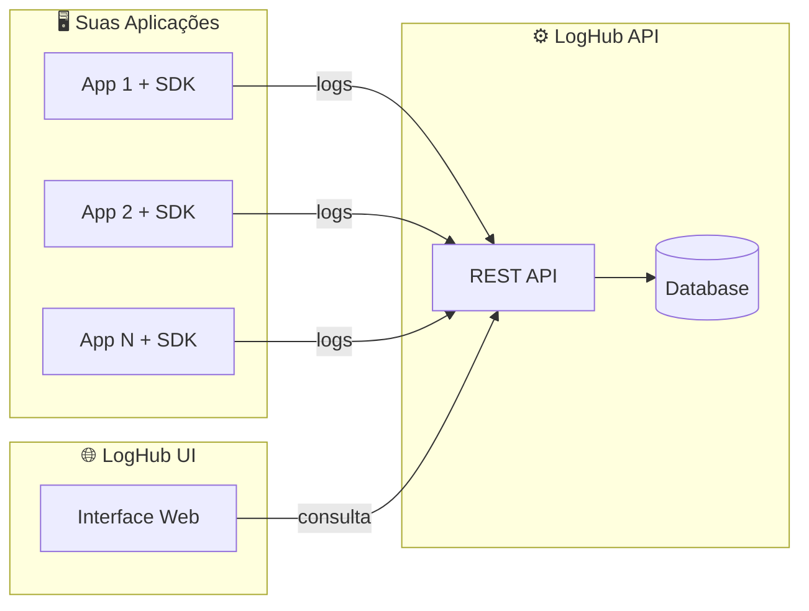

# LogHub SDK

<p align="center">
  
  
  <a href="LICENSE"></a>
  
  
</p>

<p align="center">
  <b>Uma biblioteca open source para logging estruturado em Java</b>
</p>

---

**LogHub SDK** é um monorepo Maven multi-módulo para logging estruturado em Java. Ele fornece uma biblioteca reutilizável para capturar e enviar logs para uma API central de forma assíncrona e não-bloqueante.

## 🌟 Por que usar o LogHub SDK?

- **🚀 Fácil integração** - Configuração simples via `logback.xml`
- **⚡ Alta performance** - Envio assíncrono e não-bloqueante
- **🔒 Seguro** - Mascaramento automático de dados sensíveis
- **📦 Leve** - Sem dependências pesadas como Spring ou frameworks reativos
- **🛡️ Fail-safe** - Nunca impacta sua aplicação, mesmo em caso de falhas
- **📊 Estruturado** - Logs em JSON prontos para análise

## 📖 Índice

- [Quick Start](#-quick-start)
- [Estrutura do Monorepo](#-estrutura-do-monorepo)
- [Módulos](#-módulos)
- [Como Usar](#-como-usar)
- [Configurações do Appender](#%EF%B8%8F-configurações-do-appender)
- [Mascaramento de Dados Sensíveis](#-mascaramento-de-dados-sensíveis)
- [Build](#%EF%B8%8F-build)
- [Ecossistema LogHub](#-ecossistema-loghub)
- [Licença](#-licença)
- [Contribuindo](#-contribuindo)

## ⚡ Quick Start

```xml
<!-- Adicione ao seu pom.xml -->
<dependency>
    <groupId>io.loghub</groupId>
    <artifactId>loghub-logger</artifactId>
    <version>0.1.0-SNAPSHOT</version>
</dependency>
```

```xml
<!-- Configure no logback.xml -->
<appender name="LOGHUB" class="io.loghub.logger.appender.HttpLogAppender">
    <endpoint>http://api.loghub.io/api/logs</endpoint>
    <application>minha-app</application>
    <environment>production</environment>
</appender>
```

```java
// Use normalmente com SLF4J
Logger logger = LoggerFactory.getLogger(MinhaClasse.class);
logger.info("Log estruturado pronto!");
```

## 📁 Estrutura do Monorepo

```
loghub-sdk/
├── pom.xml                    # POM pai com configurações compartilhadas
├── README.md                  # Esta documentação
├── loghub-contract/           # Módulo de contratos
│   ├── pom.xml
│   └── src/main/java/io/loghub/contract/
│       ├── LogEvent.java      # Modelo principal de evento de log
│       ├── LogLevel.java      # Enum de níveis de log
│       └── SdkInfo.java       # Informações do SDK
└── loghub-logger/             # Módulo de logging
    ├── pom.xml
    └── src/main/java/io/loghub/logger/
        ├── appender/
        │   └── HttpLogAppender.java    # Appender customizado do Logback
        ├── config/
        │   └── LogHubConfig.java       # Configurações do SDK
        ├── context/
        │   └── LogContext.java         # Contexto para dados extras (objetos, payloads)
        ├── converter/
        │   └── LogEventConverter.java  # Conversor de eventos
        ├── http/
        │   └── LogHubHttpClient.java   # Cliente HTTP nativo
        ├── queue/
        │   └── LogEventQueue.java      # Fila assíncrona
        └── util/
            ├── SdkVersion.java         # Utilitário de versão
            └── SensitiveDataMasker.java # Mascaramento de dados sensíveis
```

## 🔹 Módulos

### loghub-contract

Módulo responsável pelo **contrato de logs**, contendo apenas os modelos Java sem lógica de negócio.

**Objetivo:** Ser a fonte única da verdade do modelo de logs utilizado pelo ecossistema LogHub.

**Contrato JSON:**
```json
{
  "application": "string",
  "environment": "string",
  "level": "TRACE | DEBUG | INFO | WARN | ERROR",
  "message": "string",
  "timestamp": "ISO-8601 UTC",
  "traceId": "string (opcional)",
  "metadata": "object (opcional)",
  "sdk": {
    "language": "string",
    "version": "string"
  }
}
```

**Classes:**
- `LogEvent` - Modelo principal do evento de log
- `LogLevel` - Enum com os níveis de log (TRACE, DEBUG, INFO, WARN, ERROR)
- `SdkInfo` - Informações sobre o SDK (language, version)

### loghub-logger

Biblioteca Java reutilizável de logging que envia logs estruturados para uma API central via HTTP.

**Características:**
- ✅ Integração via Logback Appender customizado
- ✅ Comunicação HTTP assíncrona e não-bloqueante
- ✅ Usa o HttpClient nativo do Java (java.net.http)
- ✅ Fila interna para buffering de eventos
- ✅ Nunca lança exceção para a aplicação
- ✅ Timeout e endpoint configuráveis via logback.xml
- ✅ Enriquecimento automático de logs

## 🚀 Como Usar

### 1. Instalar o SDK

Existem duas maneiras de usar o LogHub SDK:

#### Opção A: Instalação Local (Desenvolvimento)

Para uso local ou testes, instale o SDK no seu repositório Maven local:

```bash
# Clone o repositório
git clone https://github.com/seu-org/loghub-sdk.git
cd loghub-sdk

# Instale no repositório local
mvn clean install
```

Após a instalação, adicione a dependência no seu `pom.xml`:

```xml
<dependency>
    <groupId>io.loghub</groupId>
    <artifactId>loghub-logger</artifactId>
    <version>0.1.0-SNAPSHOT</version>
</dependency>
```

#### Opção B: Repositório Corporativo (Produção)

Para ambientes corporativos, publique o SDK em um gerenciador de repositórios como **Nexus**, **Artifactory** ou **GitHub Packages**.

**1. Configure o repositório no `pom.xml` pai do SDK:**

```xml
<distributionManagement>
    <repository>
        <id>nexus-releases</id>
        <name>Nexus Release Repository</name>
        <url>https://nexus.sua-empresa.com/repository/maven-releases/</url>
    </repository>
    <snapshotRepository>
        <id>nexus-snapshots</id>
        <name>Nexus Snapshot Repository</name>
        <url>https://nexus.sua-empresa.com/repository/maven-snapshots/</url>
    </snapshotRepository>
</distributionManagement>
```

**2. Configure as credenciais no `~/.m2/settings.xml`:**

```xml
<settings>
    <servers>
        <server>
            <id>nexus-releases</id>
            <username>seu-usuario</username>
            <password>sua-senha</password>
        </server>
        <server>
            <id>nexus-snapshots</id>
            <username>seu-usuario</username>
            <password>sua-senha</password>
        </server>
    </servers>
</settings>
```

**3. Publique o SDK:**

```bash
mvn clean deploy
```

**4. Configure o repositório nos projetos consumidores:**

Adicione o repositório no `pom.xml` do projeto que vai usar o SDK:

```xml
<repositories>
    <repository>
        <id>nexus-releases</id>
        <name>Nexus Release Repository</name>
        <url>https://nexus.sua-empresa.com/repository/maven-releases/</url>
    </repository>
</repositories>

<dependencies>
    <dependency>
        <groupId>io.loghub</groupId>
        <artifactId>loghub-logger</artifactId>
        <version>0.1.0</version>
    </dependency>
</dependencies>
```

### 2. Configurar logback.xml

Crie ou edite o arquivo `src/main/resources/logback.xml`:

```xml
<?xml version="1.0" encoding="UTF-8"?>
<configuration>

    <!-- Console appender para desenvolvimento local -->
    <appender name="CONSOLE" class="ch.qos.logback.core.ConsoleAppender">
        <encoder>
            <pattern>%d{yyyy-MM-dd HH:mm:ss.SSS} [%thread] %-5level %logger{36} - %msg%n</pattern>
        </encoder>
    </appender>

    <!-- LogHub HTTP Appender -->
    <appender name="LOGHUB" class="io.loghub.logger.appender.HttpLogAppender">
        <!-- Obrigatório: Endpoint da API LogHub -->
        <endpoint>http://api.loghub.io/api/logs</endpoint>
        
        <!-- Obrigatório: Nome da aplicação -->
        <application>minha-aplicacao</application>
        
        <!-- Obrigatório: Ambiente -->
        <environment>production</environment>
        
        <!-- API Key para autenticação (ver seção abaixo) -->
        <apiKey>${LOGHUB_API_KEY:-}</apiKey>
        
        <!-- Opcional: Timeout em ms (padrão: 5000) -->
        <timeoutMs>5000</timeoutMs>
        
        <!-- Opcional: Capacidade da fila (padrão: 1000) -->
        <queueCapacity>1000</queueCapacity>
        
        <!-- Opcional: Nível mínimo (padrão: INFO) -->
        <minimumLevel>INFO</minimumLevel>
        
        <!-- Opcional: Habilitar/desabilitar (padrão: true) -->
        <enabled>true</enabled>
    </appender>

    <root level="INFO">
        <appender-ref ref="CONSOLE"/>
        <appender-ref ref="LOGHUB"/>
    </root>

</configuration>
```

### 🔐 Configuração da API Key

O LogHub SDK requer uma API Key para autenticar as requisições. A API Key é enviada no header `X-API-KEY`.

#### Ordem de Resolução

O SDK busca a API Key nas seguintes fontes (em ordem de prioridade):

| Prioridade | Fonte | Exemplo |
|------------|-------|---------|
| 1️⃣ | Configuração no `logback.xml` | `<apiKey>minha-api-key</apiKey>` |
| 2️⃣ | System Property | `-Dloghub.api.key=minha-api-key` |
| 3️⃣ | Variável de Ambiente | `LOGHUB_API_KEY=minha-api-key` |

#### Configuração por Ambiente

| Ambiente | Recomendação |
|----------|--------------|
| **Desenvolvimento** | Configurar diretamente no `logback.xml` ou usar `loghub-dev-key-2024` |
| **Testes** | Usar System Property: `-Dloghub.api.key=test-api-key` |
| **Produção** | **Sempre usar variável de ambiente** para não expor a chave |

#### Exemplos de Configuração

**Desenvolvimento (logback.xml):**
```xml
<apiKey>loghub-dev-key-2024</apiKey>
```

**Produção (variável de ambiente):**
```bash
# Linux/macOS
export LOGHUB_API_KEY=sua-api-key-producao

# Windows PowerShell
$env:LOGHUB_API_KEY = "sua-api-key-producao"

# Docker
docker run -e LOGHUB_API_KEY=sua-api-key-producao minha-app
```

**Spring Boot com variável de ambiente no logback.xml:**
```xml
<!-- Usa variável de ambiente, com fallback para dev -->
<apiKey>${LOGHUB_API_KEY:-loghub-dev-key-2024}</apiKey>
```

**Via JVM arguments:**
```bash
java -Dloghub.api.key=minha-api-key -jar minha-app.jar
```

#### Respostas de Erro

| Código HTTP | Descrição |
|-------------|-----------|
| `401` | API Key ausente ou inválida |
| `403` | API Key não tem permissão para este recurso |

### 3. Usar o Logger Normalmente

Use o SLF4J como de costume - o LogHub captura automaticamente:

```java
import org.slf4j.Logger;
import org.slf4j.LoggerFactory;
import org.slf4j.MDC;

public class MinhaClasse {
    private static final Logger logger = LoggerFactory.getLogger(MinhaClasse.class);

    public void exemploDeUso() {
        // Logs simples
        logger.info("Usuário logado com sucesso");
        logger.warn("Tentativa de acesso não autorizado");
        logger.error("Erro ao processar requisição");

        // Com trace ID para rastreamento distribuído
        MDC.put("traceId", "abc-123-xyz");
        try {
            logger.info("Processando requisição com trace");
        } finally {
            MDC.remove("traceId");
        }

        // Com metadados adicionais via MDC
        MDC.put("userId", "user-456");
        MDC.put("requestId", "req-789");
        try {
            logger.info("Ação do usuário registrada");
        } finally {
            MDC.clear();
        }
    }
```

### 4. Adicionar Dados Extras ao Metadata (LogContext)

Use o `LogContext` para adicionar dados extras que serão incluídos no metadata do log:

```java
import io.loghub.logger.context.LogContext;
import org.slf4j.Logger;
import org.slf4j.LoggerFactory;

public class OrderService {
    private static final Logger logger = LoggerFactory.getLogger(OrderService.class);

    public void processOrder(Order order, User user) {
        try {
            // Adicionar valores ao contexto
            LogContext.put("orderId", order.getId());
            LogContext.put("userId", user.getId());
            LogContext.put("orderTotal", String.valueOf(order.getTotal()));
            LogContext.put("region", "south");
            LogContext.put("priority", "high");
            
            // Adicionar múltiplos valores de uma vez
            LogContext.putAll(Map.of(
                "channel", "web",
                "version", "2.0"
            ));
            
            logger.info("Processando pedido");
            // O log incluirá todos os dados do LogContext no metadata
            
            processPayment(order);
            logger.info("Pagamento processado com sucesso");
            
        } catch (Exception e) {
            // Exceções também são capturadas no metadata
            logger.error("Erro ao processar pedido", e);
            throw e;
        } finally {
            // IMPORTANTE: Sempre limpar o contexto
            LogContext.clear();
        }
    }
}
```

#### Exemplo de JSON enviado para a API:

```json
{
  "application": "order-service",
  "environment": "production",
  "level": "INFO",
  "message": "Processando pedido",
  "timestamp": "2024-01-15T10:30:00.000Z",
  "traceId": "abc-123-xyz",
  "metadata": {
    "logger": "com.example.OrderService",
    "thread": "http-nio-8080-exec-1",
    "orderId": "ORD-001",
    "userId": "USR-123",
    "orderTotal": "150.99",
    "region": "south",
    "priority": "high",
    "channel": "web",
    "version": "2.0"
  },
  "sdk": {
    "language": "java",
    "version": "0.1.0"
  }
}
```

#### Uso com Filtros (Web Applications):

```java
import io.loghub.logger.context.LogContext;
import javax.servlet.*;

public class LogContextFilter implements Filter {
    
    @Override
    public void doFilter(ServletRequest request, ServletResponse response, 
                         FilterChain chain) throws IOException, ServletException {
        try {
            HttpServletRequest httpRequest = (HttpServletRequest) request;
            
            // Adicionar contexto da requisição
            LogContext.put("requestId", UUID.randomUUID().toString());
            LogContext.put("clientIp", request.getRemoteAddr());
            LogContext.put("method", httpRequest.getMethod());
            LogContext.put("path", httpRequest.getRequestURI());
            LogContext.put("userAgent", httpRequest.getHeader("User-Agent"));
            
            chain.doFilter(request, response);
            
        } finally {
            // Limpar contexto ao final da requisição
            LogContext.removeContext();
        }
    }
}
```

#### Métodos Disponíveis no LogContext:

| Método | Descrição |
|--------|-----------|
| `put(key, value)` | Adiciona String, Number ou Boolean (convertido para String) |
| `putAll(map)` | Adiciona todos os valores de um Map |
| `get(key)` | Obtém um valor |
| `remove(key)` | Remove um valor |
| `getAll()` | Retorna todos os valores |
| `isEmpty()` | Verifica se está vazio |
| `clear()` | Limpa todos os valores |
| `removeContext()` | Remove o contexto do thread (para thread pools) |

## 🔒 Mascaramento de Dados Sensíveis

O SDK mascara automaticamente dados sensíveis em mensagens de log e metadados para prevenir vazamento de informações confidenciais.

### Dados Mascarados Automaticamente

| Tipo | Exemplo Original | Exemplo Mascarado |
|------|------------------|-------------------|
| Email | `john@example.com` | `j***@***.com` |
| Cartão de Crédito | `4111-1111-1111-1111` | `*********1111` |
| CPF | `123.456.789-09` | `***.***.***-09` |
| CNPJ | `12.345.678/0001-95` | `***.***/***-95` |
| Telefone | `(11) 98765-4321` | `(***) ***-4321` |

### Campos Sensíveis (Mascarados por Nome)

Os seguintes campos são automaticamente mascarados no metadata:

- `password`, `senha`, `pwd`, `pass`
- `token`, `accessToken`, `refreshToken`
- `apiKey`, `api_key`, `secret`
- `authorization`, `bearer`, `credential`
- `cpf`, `cnpj`, `ssn`, `rg`
- `cardNumber`, `creditCard`, `cvv`, `cvc`, `pin`
- `privateKey`, `publicKey`, `certificate`

### Exemplos

```java
// Email no log será mascarado automaticamente
logger.info("Usuário john@example.com criado");
// Enviado como: "Usuário j***@***.com criado"

// Campo 'password' no metadata será mascarado
LogContext.put("password", "minhasenha123");
// Enviado como: "mi******23"

// CPF na mensagem será mascarado
logger.info("CPF do cliente: 123.456.789-09");
// Enviado como: "CPF do cliente: ***.***.***-09"
```

### Adicionar Campos Sensíveis Personalizados

```java
import io.loghub.logger.util.SensitiveDataMasker;

// Adicionar um campo personalizado como sensível
SensitiveDataMasker.addSensitiveField("meuCampoSecreto");

// Remover um campo da lista de sensíveis (não recomendado)
SensitiveDataMasker.removeSensitiveField("email");
```

### Usar o Mascarador Manualmente

```java
import io.loghub.logger.util.SensitiveDataMasker;

// Mascarar padrões sensíveis em um texto
String masked = SensitiveDataMasker.mask("Email: john@test.com, CPF: 123.456.789-09");

// Verificar se um campo é sensível
boolean isSensitive = SensitiveDataMasker.isSensitiveField("password"); // true

// Mascarar valor se o campo for sensível
String value = SensitiveDataMasker.maskIfSensitive("apiKey", "sk-1234567890");
```

## ⚙️ Configurações do Appender

| Propriedade     | Tipo    | Padrão    | Descrição                          |
|-----------------|---------|-----------|------------------------------------|
| `endpoint`      | String  | -         | **Obrigatório.** URL da API LogHub |
| `application`   | String  | "unknown" | Nome da aplicação                  |
| `environment`   | String  | "unknown" | Ambiente (dev, staging, prod)      |
| `timeoutMs`     | int     | 5000      | Timeout da requisição HTTP em ms   |
| `queueCapacity` | int     | 1000      | Capacidade máxima da fila interna  |
| `workerThreads` | int     | 1         | Número de threads para envio       |
| `minimumLevel`  | String  | "INFO"    | Nível mínimo para captura          |
| `enabled`       | boolean | true      | Habilita/desabilita o appender     |

## 🔧 Enriquecimento Automático

O SDK enriquece automaticamente cada log com:

| Campo                  | Origem                          |
|------------------------|---------------------------------|
| `application`          | Configuração do logback.xml     |
| `environment`          | Configuração do logback.xml     |
| `timestamp`            | `Instant.now()` em UTC          |
| `level`                | Mapeado do nível do Logback     |
| `message`              | Mensagem original do log        |
| `traceId`              | MDC key "traceId" (se presente) |
| `metadata.logger`      | Nome do logger                  |
| `metadata.thread`      | Nome da thread                  |
| `metadata.*`           | Outras keys do MDC              |
| `metadata.exception.*` | Info de exceção (se presente)   |
| `sdk.language`         | "java"                          |
| `sdk.version`          | Versão do SDK                   |

## 🏗️ Build

### Requisitos

- Java 17+
- Maven 3.8+

### Comandos

```bash
# Compilar todos os módulos
mvn clean compile

# Executar testes
mvn test

# Instalar no repositório local
mvn clean install

# Gerar pacotes
mvn clean package
```

## 📋 Exemplo de Log Enviado

```json
{
  "application": "minha-aplicacao",
  "environment": "production",
  "level": "INFO",
  "message": "Usuário logado com sucesso",
  "timestamp": "2024-01-15T10:30:45.123Z",
  "traceId": "abc-123-xyz",
  "metadata": {
    "logger": "com.example.MinhaClasse",
    "thread": "main",
    "userId": "user-456"
  },
  "sdk": {
    "language": "java",
    "version": "0.1.0-SNAPSHOT"
  }
}
```

## 🛡️ Características de Segurança

- **Non-blocking:** O envio de logs nunca bloqueia a aplicação
- **Fail-safe:** Erros de envio são silenciados - logs nunca causam crashes
- **Bounded queue:** Fila limitada evita memory leaks
- **Daemon threads:** Workers não impedem o shutdown da JVM
- **Timeout configurável:** Requisições HTTP têm timeout definido

## 🚫 Restrições

Este SDK foi projetado para ser leve e focado:

- ❌ Não usa Spring
- ❌ Não usa frameworks reativos
- ❌ Não implementa autenticação
- ❌ Não cria dashboard
- ❌ Não cria API backend

## 🌐 Ecossistema LogHub

O LogHub SDK faz parte de um ecossistema completo para gerenciamento de logs. Conheça os outros projetos:

| Projeto | Descrição | Link |
|---------|-----------|------|
| **LogHub API** | Backend RESTful para coleta, armazenamento e consulta de logs | [loghub-api](https://github.com/BrininhoBru/loghub-api) |
| **LogHub SDK** | SDK para integração fácil das suas aplicações com o LogHub | Este repositório |
| **LogHub UI** | Interface web para visualização e diagnóstico de logs | [loghub-ui](https://github.com/BrininhoBru/loghub-ui) |

### Arquitetura



### Como funciona

1. **Suas aplicações** usam o **LogHub SDK** para enviar logs estruturados
2. Os logs são enviados via HTTP para a **LogHub API**
3. A API armazena e indexa os logs no banco de dados
4. Você visualiza e analisa os logs através da **LogHub UI**

## 📝 Licença

Este projeto está licenciado sob a **MIT License** - uma licença permissiva que permite uso comercial, modificação, distribuição e uso privado. Veja o arquivo [LICENSE](LICENSE) para mais detalhes.

## 🤝 Contribuindo

Contribuições são muito bem-vindas! 🎉

### Como contribuir

1. **Fork** o repositório
2. **Clone** seu fork: `git clone https://github.com/seu-usuario/loghub-sdk.git`
3. **Crie uma branch** para sua feature: `git checkout -b feature/nova-feature`
4. **Faça suas alterações** e adicione testes
5. **Commit** suas mudanças seguindo o padrão [Conventional Commits](https://www.conventionalcommits.org/)
6. **Push** para a branch: `git push origin feature/nova-feature`
7. Abra um **Pull Request**

### Diretrizes

- Siga as convenções de código existentes
- Adicione testes para novas funcionalidades
- Atualize a documentação quando necessário
- Seja respeitoso nas discussões

### Tipos de contribuição

- 🐛 **Reportar bugs** - Encontrou um problema? Abra uma [issue](https://github.com/loghub/loghub-sdk/issues)
- 💡 **Sugerir features** - Tem uma ideia? Compartilhe em uma [issue](https://github.com/loghub/loghub-sdk/issues)
- 📝 **Melhorar documentação** - Ajude outros desenvolvedores
- 🔧 **Enviar PRs** - Correções e melhorias são sempre bem-vindas

### 📝 Padrão de Commits

Este projeto utiliza o padrão **Conventional Commits**. Use prefixos semânticos para descrever suas mudanças:

```bash
git commit -m "feat: adiciona suporte para retry automático"
git commit -m "fix: corrige vazamento de memória na fila"
git commit -m "docs: atualiza documentação do appender"
git commit -m "refactor: melhora legibilidade do HttpLogAppender"
git commit -m "test: adiciona testes para LogEventConverter"
git commit -m "perf: melhora performance do envio de logs"
git commit -m "chore: ajusta configuração padrão de timeout"
```

**Tipos de commit:**

| Tipo | Descrição |
|------|-----------|
| `feat` | Nova feature |
| `fix` | Correção de bug |
| `docs` | Documentação |
| `refactor` | Refatoração de código |
| `test` | Adição ou modificação de testes |
| `perf` | Melhoria de performance |
| `chore` | Outras alterações (configs, dependências) |
| `style` | Formatação de código |

Veja a especificação completa em [conventionalcommits.org](https://www.conventionalcommits.org/)

## 🙏 Agradecimentos

Obrigado a todos os [contribuidores](https://github.com/loghub/loghub-sdk/graphs/contributors) que ajudam a tornar este projeto melhor!

## 📧 Contato

- **Issues**: [GitHub Issues](https://github.com/loghub/loghub-sdk/issues)
- **Discussões**: [GitHub Discussions](https://github.com/loghub/loghub-sdk/discussions)

---

<p align="center">
  Feito com ❤️ pela comunidade open source
</p>
