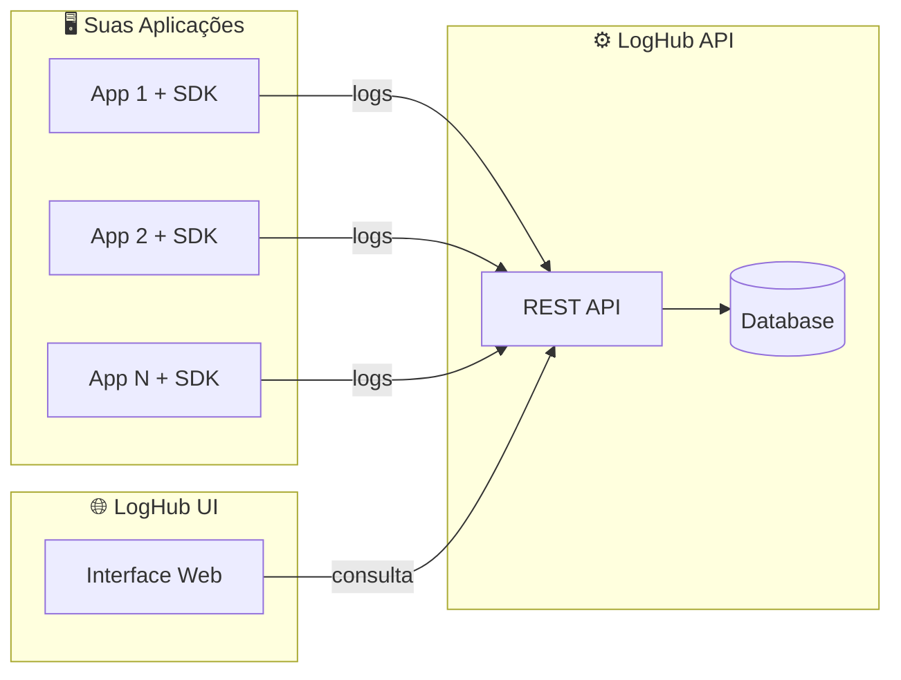

<div align="center">

# 📦 LogHub SDK

**SDK Java para logging estruturado com envio assíncrono para o LogHub**

[](https://openjdk.org/)
[](https://maven.apache.org/)
[](LICENSE)
[](https://github.com/LogHub-Open/.github/blob/main/CONTRIBUTING.md)

[Sobre](#-sobre) •
[Instalação](#-instalação) •
[Como Usar](#-como-usar) •
[Segurança](#-mascaramento-de-dados-sensíveis) •
[Contribuindo](#-contribuindo) •
[Licença](#-licença)

</div>

---

## 📋 Sumário

- [Sobre](#-sobre)
- [Funcionalidades](#-funcionalidades)
- [Estrutura do Monorepo](#-estrutura-do-monorepo)
- [Módulos](#-módulos)
- [Instalação](#-instalação)
- [Como Usar](#-como-usar)
- [Configuração da API Key](#-configuração-da-api-key)
- [Mascaramento de Dados Sensíveis](#-mascaramento-de-dados-sensíveis)
- [Configurações do Appender](#️-configurações-do-appender)
- [Build](#️-build)
- [Restrições de Escopo](#-restrições-de-escopo)
- [Ecossistema LogHub](#-ecossistema-loghub)
- [Contribuindo](#-contribuindo)
- [Licença](#-licença)

## ✨ Sobre

O **LogHub SDK** é um monorepo Maven multi-módulo que fornece uma biblioteca Java reutilizável para capturar e enviar logs estruturados para a [LogHub API](https://github.com/LogHub-Open/loghub-api) de forma assíncrona e não-bloqueante, via um appender customizado do Logback.

## 🌟 Funcionalidades

- **🚀 Fácil integração** — configuração simples via `logback.xml`
- **⚡ Alta performance** — envio assíncrono e não-bloqueante, com fila interna
- **🔒 Seguro** — mascaramento automático de dados sensíveis
- **📦 Leve** — sem dependências pesadas como Spring ou frameworks reativos
- **🛡️ Fail-safe** — nunca impacta a aplicação, mesmo em caso de falha no envio
- **📊 Estruturado** — logs em JSON prontos para análise

## 📁 Estrutura do Monorepo

```
loghub-sdk/
├── pom.xml                    # POM pai com configurações compartilhadas
├── loghub-contract/           # Módulo de contratos (modelo de dados)
│   ├── pom.xml
│   └── src/main/java/io/loghub/contract/
│       ├── LogEvent.java      # Modelo principal de evento de log
│       ├── LogLevel.java      # Enum de níveis de log
│       └── SdkInfo.java       # Informações do SDK
└── loghub-logger/             # Módulo de logging
    ├── pom.xml
    └── src/main/java/io/loghub/logger/
        ├── appender/          # HttpLogAppender (Logback)
        ├── config/            # LogHubConfig
        ├── context/           # LogContext (dados extras)
        ├── converter/         # LogEventConverter
        ├── http/              # LogHubHttpClient (java.net.http)
        ├── queue/             # LogEventQueue (fila assíncrona)
        └── util/              # SdkVersion, SensitiveDataMasker
```

## 🔹 Módulos

### `loghub-contract`

Responsável pelo **contrato de logs**: modelos Java sem lógica de negócio, fonte única da verdade do formato usado por todo o ecossistema LogHub.

**Contrato JSON:**
```json
{
  "application": "string",
  "environment": "string",
  "level": "TRACE | DEBUG | INFO | WARN | ERROR",
  "message": "string",
  "timestamp": "ISO-8601 UTC",
  "traceId": "string (opcional)",
  "metadata": "object (opcional)",
  "sdk": {
    "language": "string",
    "version": "string"
  }
}
```

### `loghub-logger`

Biblioteca de logging que envia eventos estruturados para a API central via HTTP.

- ✅ Integração via appender customizado do Logback
- ✅ Comunicação HTTP assíncrona, usando `java.net.http.HttpClient`
- ✅ Fila interna para buffering de eventos
- ✅ Nunca lança exceção para a aplicação
- ✅ Timeout e endpoint configuráveis via `logback.xml`
- ✅ Enriquecimento automático de logs (thread, logger, exceção, MDC)

## 📦 Instalação

### Pré-requisitos

- Java 17+
- Maven 3.8+

### Opção A — Instalação local (desenvolvimento)

```bash
git clone https://github.com/LogHub-Open/loghub-sdk.git
cd loghub-sdk
mvn clean install
```

```xml
<dependency>
    <groupId>io.loghub</groupId>
    <artifactId>loghub-logger</artifactId>
    <version>0.1.0-SNAPSHOT</version>
</dependency>
```

### Opção B — Repositório corporativo (produção)

Para publicar o SDK em um gerenciador como **Nexus**, **Artifactory** ou **GitHub Packages**, configure o `distributionManagement` no `pom.xml` pai e publique com:

```bash
mvn clean deploy
```

Nos projetos consumidores, adicione o repositório e a dependência correspondentes.

## 🚀 Como Usar

### 1. Configurar o `logback.xml`

```xml
<?xml version="1.0" encoding="UTF-8"?>
<configuration>

    <appender name="CONSOLE" class="ch.qos.logback.core.ConsoleAppender">
        <encoder>
            <pattern>%d{yyyy-MM-dd HH:mm:ss.SSS} [%thread] %-5level %logger{36} - %msg%n</pattern>
        </encoder>
    </appender>

    <appender name="LOGHUB" class="io.loghub.logger.appender.HttpLogAppender">
        <endpoint>http://api.loghub.io/api/logs</endpoint>
        <application>minha-aplicacao</application>
        <environment>production</environment>
        <apiKey>${LOGHUB_API_KEY:-}</apiKey>
        <timeoutMs>5000</timeoutMs>
        <queueCapacity>1000</queueCapacity>
        <minimumLevel>INFO</minimumLevel>
        <enabled>true</enabled>
    </appender>

    <root level="INFO">
        <appender-ref ref="CONSOLE"/>
        <appender-ref ref="LOGHUB"/>
    </root>

</configuration>
```

### 2. Usar o logger normalmente (SLF4J)

```java
import org.slf4j.Logger;
import org.slf4j.LoggerFactory;
import org.slf4j.MDC;

public class MinhaClasse {
    private static final Logger logger = LoggerFactory.getLogger(MinhaClasse.class);

    public void exemploDeUso() {
        logger.info("Usuário logado com sucesso");

        MDC.put("traceId", "abc-123-xyz");
        try {
            logger.info("Processando requisição com trace");
        } finally {
            MDC.remove("traceId");
        }
    }
}
```

### 3. Adicionar dados extras com `LogContext`

```java
import io.loghub.logger.context.LogContext;

public class OrderService {
    public void processOrder(Order order, User user) {
        try {
            LogContext.put("orderId", order.getId());
            LogContext.put("userId", user.getId());
            LogContext.putAll(Map.of("channel", "web", "version", "2.0"));

            logger.info("Processando pedido");
            processPayment(order);
        } catch (Exception e) {
            logger.error("Erro ao processar pedido", e);
            throw e;
        } finally {
            LogContext.clear(); // sempre limpar o contexto
        }
    }
}
```

| Método | Descrição |
|--------|-----------|
| `put(key, value)` | Adiciona String, Number ou Boolean (convertido para String) |
| `putAll(map)` | Adiciona todos os valores de um Map |
| `get(key)` | Obtém um valor |
| `remove(key)` | Remove um valor |
| `getAll()` | Retorna todos os valores |
| `clear()` | Limpa todos os valores |
| `removeContext()` | Remove o contexto da thread (para thread pools) |

## 🔐 Configuração da API Key

A API Key é enviada no header `X-API-KEY` e resolvida na seguinte ordem de prioridade:

| Prioridade | Fonte | Exemplo |
|------------|-------|---------|
| 1 | `logback.xml` | `<apiKey>minha-api-key</apiKey>` |
| 2 | System Property | `-Dloghub.api.key=minha-api-key` |
| 3 | Variável de ambiente | `LOGHUB_API_KEY=minha-api-key` |

```bash
# Produção — sempre usar variável de ambiente
export LOGHUB_API_KEY=sua-api-key-producao
```

| Código HTTP | Descrição |
|-------------|-----------|
| `401` | API Key ausente ou inválida |
| `403` | API Key sem permissão para o recurso |

## 🔒 Mascaramento de Dados Sensíveis

O SDK mascara automaticamente dados sensíveis em mensagens e metadados antes do envio.

### Dados mascarados automaticamente

| Tipo | Original | Mascarado |
|------|----------|-----------|
| Email | `john@example.com` | `j***@***.com` |
| Cartão de crédito | `4111-1111-1111-1111` | `*********1111` |
| CPF | `123.456.789-09` | `***.***.***-09` |
| CNPJ | `12.345.678/0001-95` | `***.***/***-95` |
| Telefone | `(11) 98765-4321` | `(***) ***-4321` |

### Campos sensíveis mascarados por nome

`password`, `senha`, `token`, `apiKey`, `secret`, `authorization`, `cpf`, `cnpj`, `cardNumber`, `cvv`, `privateKey`, entre outros.

```java
import io.loghub.logger.util.SensitiveDataMasker;

SensitiveDataMasker.addSensitiveField("meuCampoSecreto");
String masked = SensitiveDataMasker.mask("Email: john@test.com, CPF: 123.456.789-09");
```

## ⚙️ Configurações do Appender

| Propriedade | Tipo | Padrão | Descrição |
|-------------|------|--------|-----------|
| `endpoint` | String | — | **Obrigatório.** URL da API LogHub |
| `application` | String | `unknown` | Nome da aplicação |
| `environment` | String | `unknown` | Ambiente (dev, staging, prod) |
| `timeoutMs` | int | 5000 | Timeout da requisição HTTP em ms |
| `queueCapacity` | int | 1000 | Capacidade máxima da fila interna |
| `workerThreads` | int | 1 | Número de threads para envio |
| `minimumLevel` | String | `INFO` | Nível mínimo para captura |
| `enabled` | boolean | true | Habilita/desabilita o appender |

## 🏗️ Build

```bash
mvn clean compile   # Compilar todos os módulos
mvn test             # Executar testes
mvn clean install    # Instalar no repositório local
mvn clean package    # Gerar pacotes
```

## 🚫 Restrições de Escopo

Este SDK foi projetado para ser leve e focado — propositalmente **não**:

- Usa Spring ou frameworks reativos
- Implementa autenticação própria
- Cria dashboard ou API backend

## 🌐 Ecossistema LogHub

O LogHub SDK faz parte de um ecossistema completo para gerenciamento de logs:

| Projeto | Descrição | Link |
|---------|-----------|------|
| **LogHub API** | Backend RESTful para coleta, armazenamento e consulta de logs | [loghub-api](https://github.com/LogHub-Open/loghub-api) |
| **LogHub SDK** | SDK para integração das aplicações com o LogHub | Este repositório |
| **LogHub UI** | Interface web para visualização e diagnóstico de logs | [loghub-ui](https://github.com/LogHub-Open/loghub-ui) |



**Como funciona:** suas aplicações usam o **SDK** para enviar logs estruturados via HTTP para a **API**, que os armazena e indexa; você visualiza e analisa os dados através da **UI**.

## 🤝 Contribuindo

Contribuições são muito bem-vindas! Este projeto segue as diretrizes gerais da organização:

- 📖 [Guia de Contribuição](https://github.com/LogHub-Open/.github/blob/main/CONTRIBUTING.md) — como abrir fork, branch e Pull Request, e como reportar bugs ou sugerir melhorias
- 🤝 [Código de Conduta](https://github.com/LogHub-Open/.github/blob/main/CODE_OF_CONDUCT.md)
- 🔒 [Política de Segurança](https://github.com/LogHub-Open/.github/blob/main/SECURITY.md) — para reportar vulnerabilidades

Padrão rápido de commit ([Conventional Commits](https://www.conventionalcommits.org/pt-br/)):

```bash
git commit -m "feat: adiciona suporte para retry automático"
git commit -m "fix: corrige vazamento de memória na fila"
```

Além dos tipos padrão (`feat`, `fix`, `docs`, `chore`), este projeto também usa `refactor`, `test`, `perf` e `style` para descrever mudanças com mais precisão.

## 📝 Licença

Este projeto está licenciado sob a [MIT License](LICENSE).

---

<div align="center">

⭐ Se este projeto te ajudou, considere dar uma estrela!

</div>
